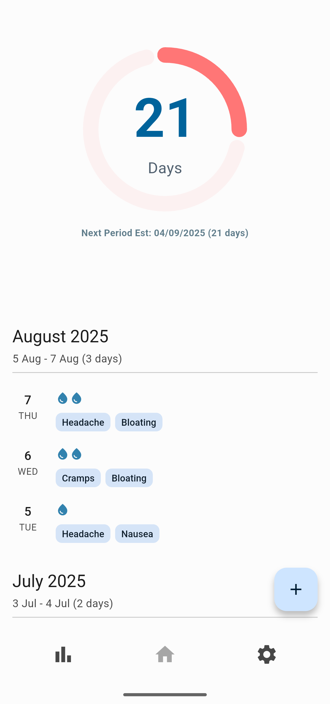
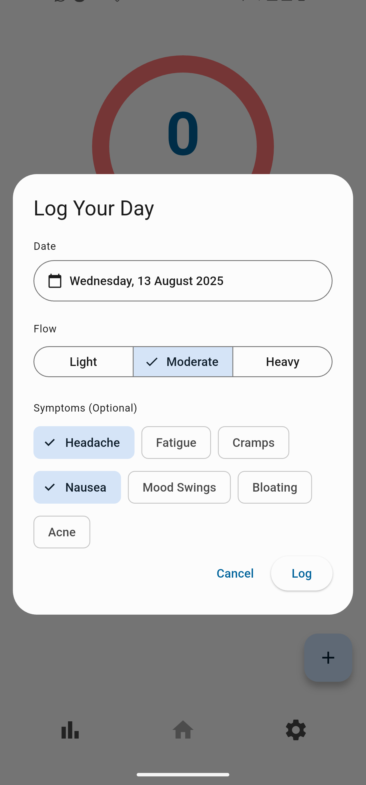
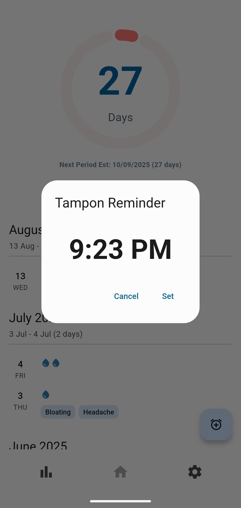
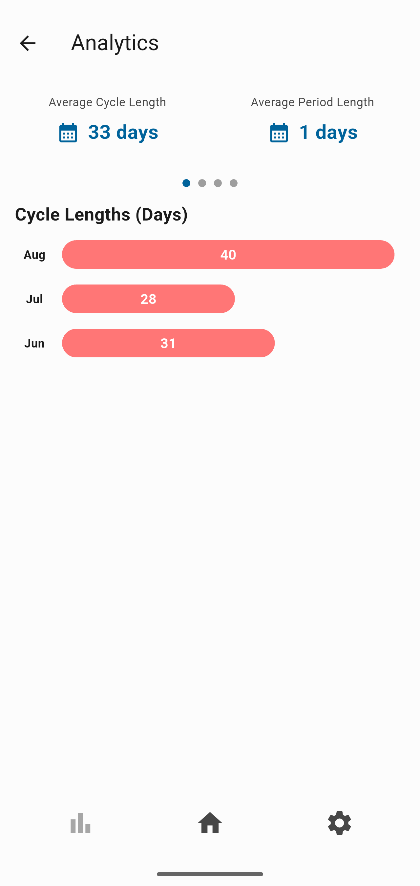
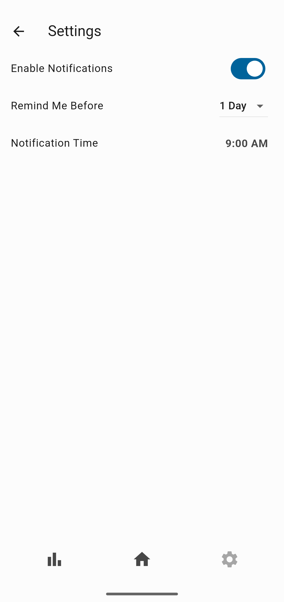

#  Menstrudel 

Free, offline, and open source period tracking app.

## About Menstrudel

Menstrudel is a simple, private, and intuitive mobile application built with Flutter to help you track your menstrual cycle. Log your period start dates, record symptoms and flow intensity, and get predictions for your next cycle. Designed with privacy in mind, all your personal health data is stored securely offline on your device.

## Features

* **Effortless Period Logging:**
    * Quickly log the start date of your period using a date picker.
    * Select associated symptoms from a dropdown (supports single selection for now).
    * Record flow intensity (Low, Medium, High) using a slider.
* **Cycle Prediction:**
    * Leverages your logged data to estimate your next period start date.
    * Calculates average cycle length by filtering out unrealistic gaps (e.g., due to missed loggings) for more reliable predictions.
    * Clearly displays the number of days until your next period, or indicates if your period is due today or overdue.
* **Period Notifications:**
    * Get a reminder a few days before your period starts.
    * Customise the days in advance to be alerted that your period is due.
    * Choose the time of day to send the notification.
* **Tampon Reminders:**
    * Get a reminder when it's time to change your tampon.
    * Defaulting to 6 hours from the current time, you choose when the alert should be sent.
* **Private Local Data Storage:** All your sensitive health data is stored securely offline on your device using SQLite, ensuring your privacy.
* **Adaptive Theme:** Supports both Light and Dark modes, adapting seamlessly to your device's system settings.
* **Completely Offline:** No internet connection. No sign ups. No adverts.
* **Free & Open Source:** Menstrudel is free to use, and its codebase is open for transparency, auditing, and community contributions.

### Privacy Policy

You can view our privacy policy [here](https://github.com/J-shw/Menstrudel/blob/dev/docs/PRIVACY.md)

# App Screenshots

| Your daily logs |  Quick symptom entry | Tampon reminder |
| :---: | :---: | :---: |
|  |  |  |
| Cycle insights | Settings |  |
 |  |  |
