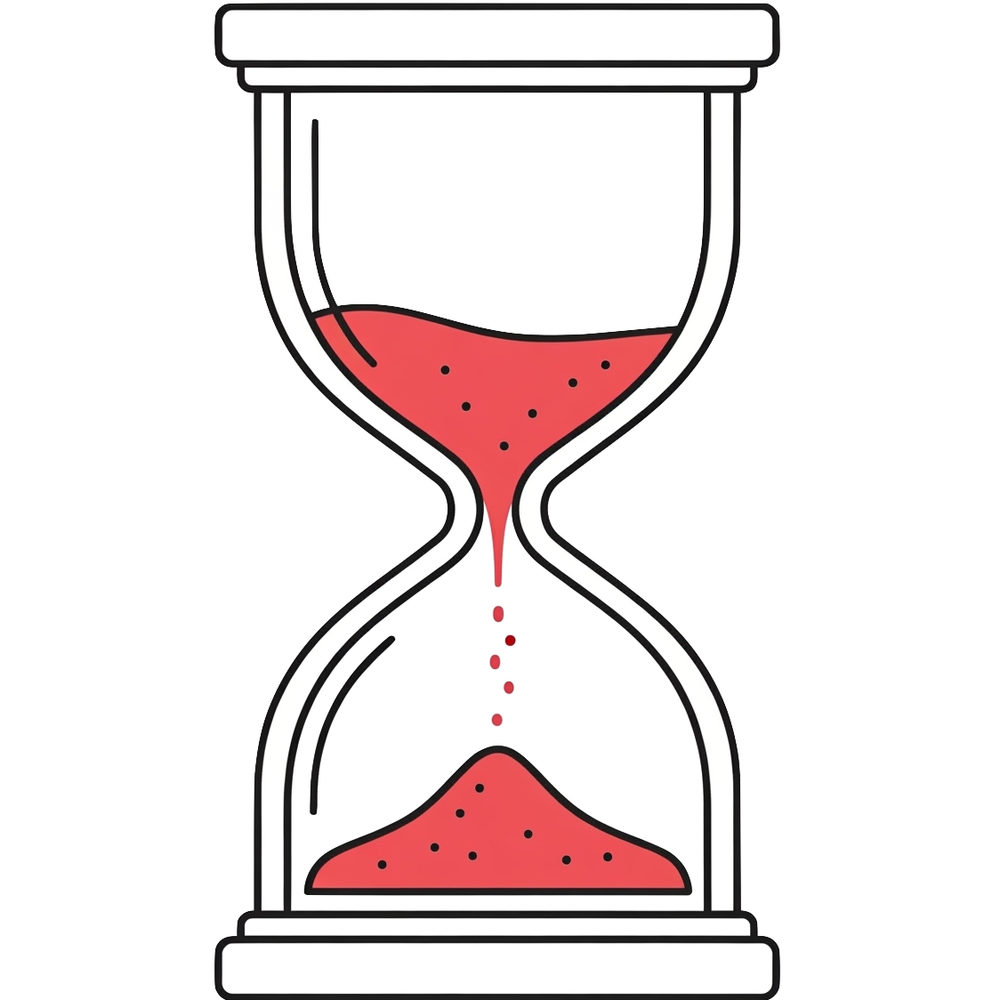
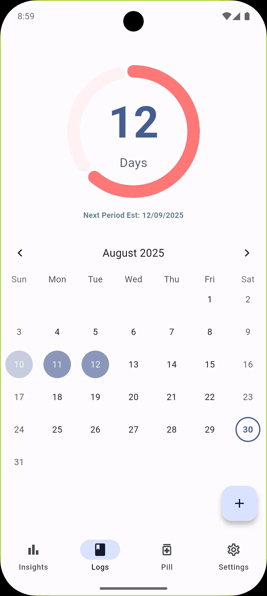
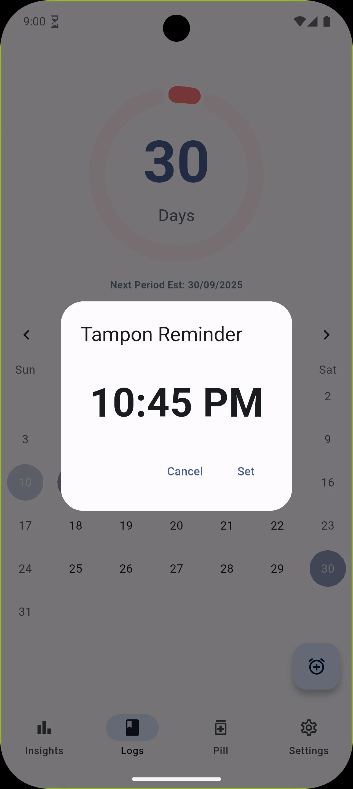
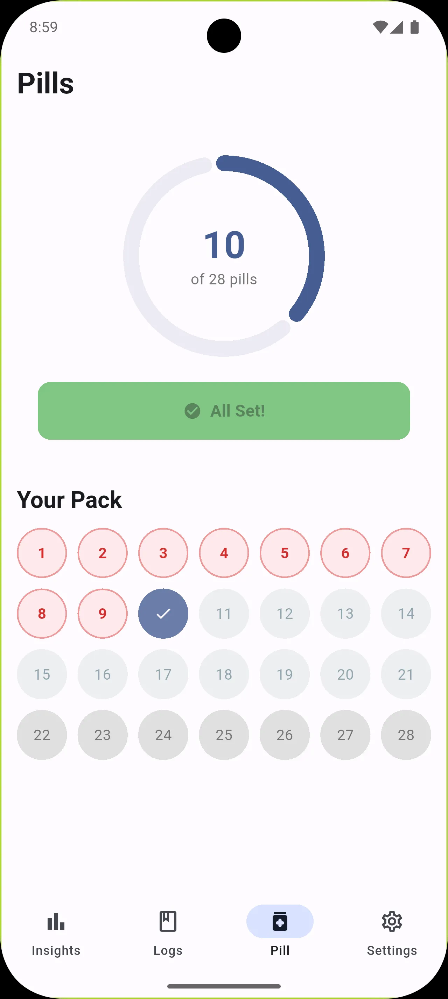
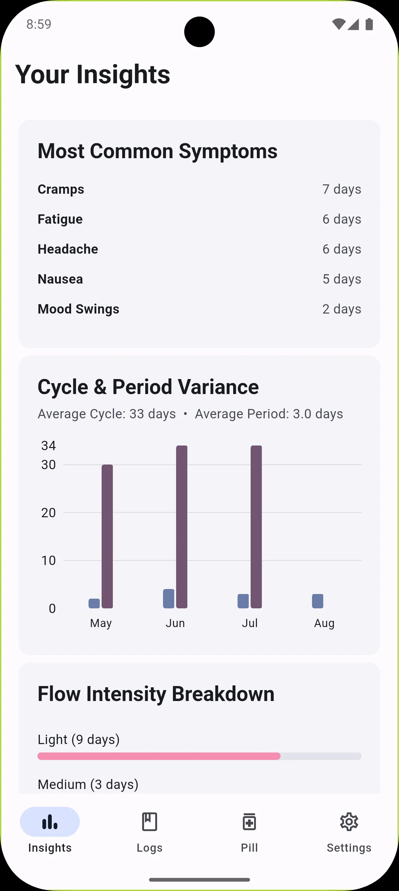
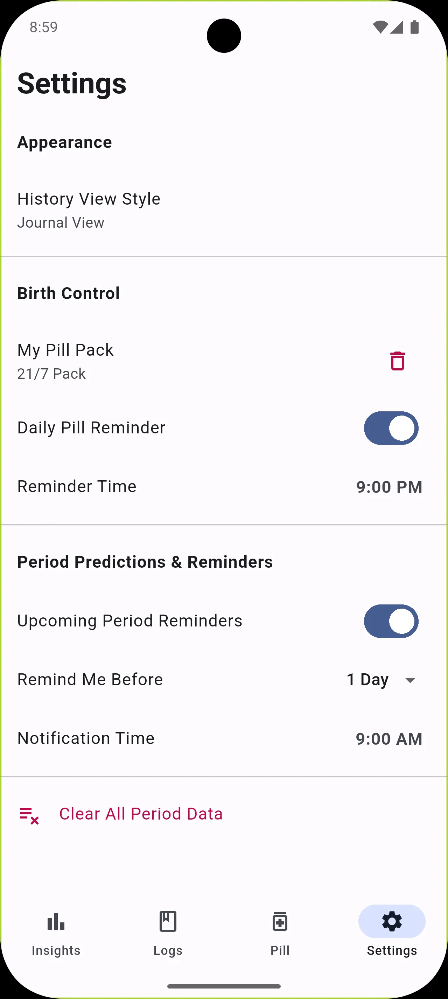

#  Menstrudel 

Free, offline, and open source period tracking app.

[Join our Playstore beta](https://groups.google.com/g/menstrudel-app-testers)

## About Menstrudel

Menstrudel is a simple, private, and intuitive mobile application built with Flutter to help you track your menstrual cycle. Log your period start dates, record symptoms and flow intensity, and get predictions for your next cycle. Designed with privacy in mind, all your personal health data is stored securely offline on your device.

## Key Features for Your Menstrual Health

* **Effortless Period Logging:**
    * Quickly log your period start date.
    * Record symptoms and flow intensity.
* **Reliable Cycle Prediction:**
    * Estimates your next period start date based on your history.
    * Calculates your average cycle length for reliable predictions.
    * Clearly displays a countdown to your next period.
* **Intuiative Pill Regimen:**
    * Easily configure your specific pill pack, whether it’s 21-day, 28-day, or custom.
    * Log your daily intake with a single tap.
* **Customisable Notifications:**
    * **Period Reminders:** Get an alert a few days before your period is due.
    * **Tampon Reminders:** Set a reminder to change your tampon for your safety.
    * **Pill Reminders:** Get an alert when its time to take your pill.
* **Secure Local Storage:** Your sensitive health data is stored offline on your device using SQLite.
* **Adaptive Theme:** Supports both Light and Dark modes.
### Privacy Policy

You can view our privacy policy [here](https://menstrudel.app/privacy/).

### Socials

- [Website](https://menstrudel.app/)
- [ItsAllWidgets](https://itsallwidgets.com/menstrudel)
- [AlternativeTo](https://alternativeto.net/software/menstrudel/about/)

# App Screenshots

| Your daily logs |  Quick symptom entry | Tampon reminder |
| :---: | :---: | :---: |
|  |  |  |
| Pill Reminder | Quick insights | Settings |
|   |  |  |  |
