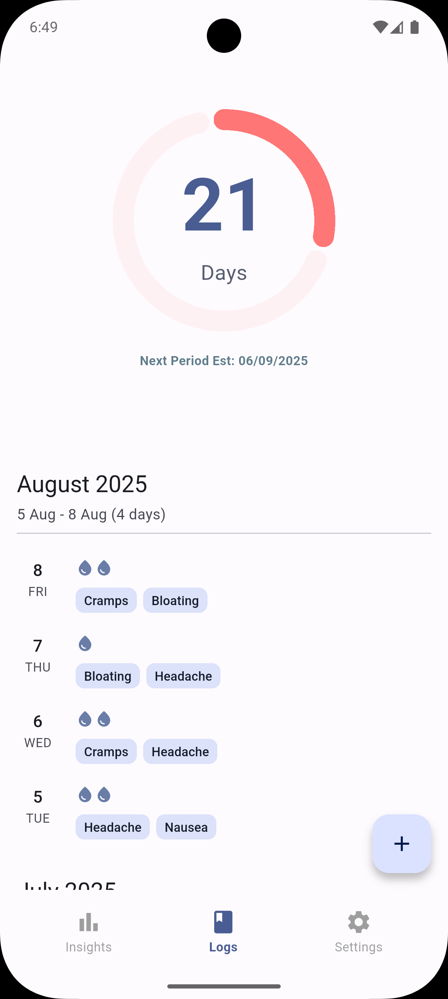
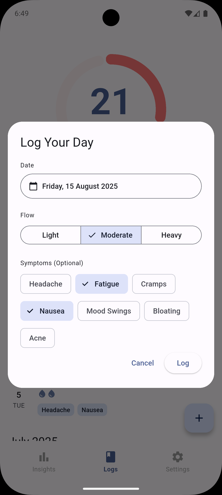
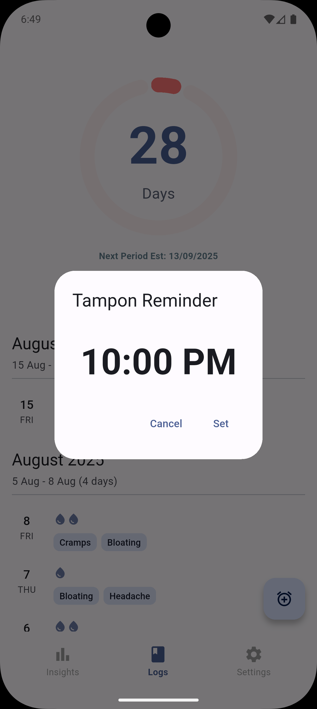
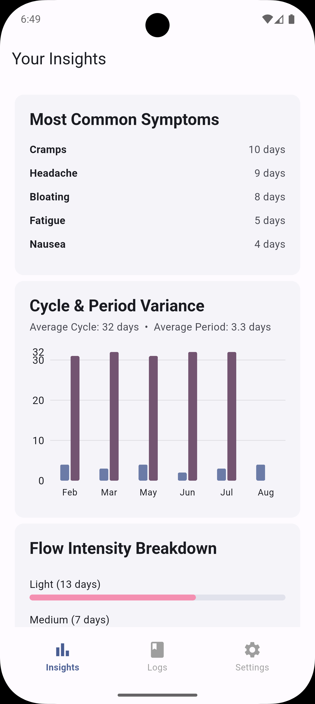
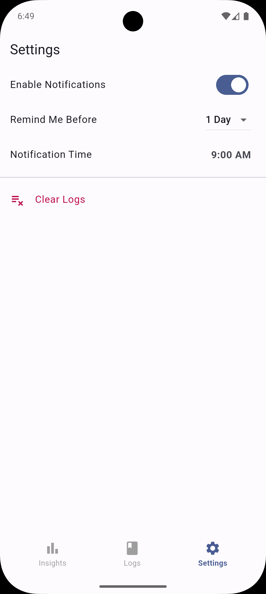

# Menstrudel: A Private, Offline Period Tracker App

**A free, open-source, and completely offline period tracking app that puts your privacy first.**

---

## Get The App

* **[Contribute on GitHub](https://github.com/J-shw/Menstrudel)**

---

## About This Privacy-First Period Tracker

Menstrudel is a simple, private, and intuitive mobile application built with Flutter to help you track your menstrual cycle. In an era where data privacy is critical, especially for health data, Menstrudel offers a secure alternative. **All your personal health data is stored securely offline on your device.** No cloud, no sign-ups, no-nonsense.

Log your period start dates, record symptoms, and get predictions for your next cycle, all without an internet connection.

### Why Choose Menstrudel?
* **Absolutely Private:** All data stays on your device. We can't see it, and we don't want to.
* **Completely Offline:** Works anywhere, anytime, without needing an internet connection.
* **100% Free & Open Source:** No ads, no subscriptions. The code is transparent and open for community review.

## Key Features for Your Menstrual Health

* **Effortless Period Logging:**
    * Quickly log your period start date.
    * Record symptoms and flow intensity.
* **Reliable Cycle Prediction:**
    * Estimates your next period start date based on your history.
    * Calculates your average cycle length for reliable predictions.
    * Clearly displays a countdown to your next period.
* **Customisable Notifications:**
    * **Period Reminders:** Get an alert a few days before your period is due.
    * **Tampon Reminders:** Set a reminder to change your tampon for your safety.
* **Secure Local Storage:** Your sensitive health data is stored offline on your device using SQLite.
* **Adaptive Theme:** Supports both Light and Dark modes.

You can view our full privacy policy [here](PRIVACY.md).

## App Screenshots

| Your Daily Logs | Quick Symptom Entry | Tampon Reminder |
| :---: | :---: | :---: |
|  |  |  |
| Cycle Insights | App Settings | |
|  |  | |