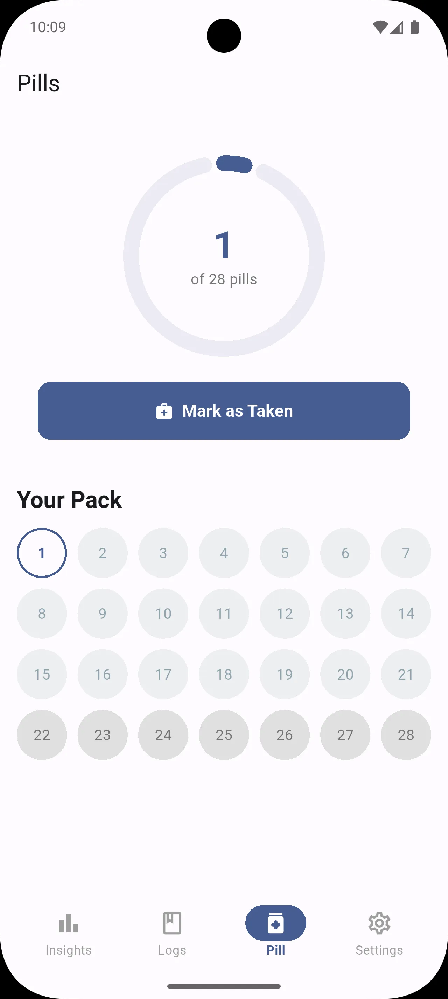

---
# index.md
layout: default
---

  <h1>Private, Offline Period Tracker App</h1>
  
Menstrudel is a free, open-source, and completely offline period tracking app that puts your privacy first.

  

    <a href="{{ site.google_group_url }}" class="cta-button primary">Join the Beta</a>
    <a href="https://github.com/J-shw/Menstrudel" class="cta-button secondary">View on GitHub</a>
  

---

## Why Menstrudel? Because Privacy Matters.

In an era where personal health data is a commodity, Menstrudel offers a secure sanctuary. All your cycle information, symptoms, and logs are stored **only on your device**. We can't see your data, and we don't want to.

* **Absolutely Private:** Your data never leaves your phone.
* **Completely Offline:** Works anywhere, anytime, without an internet connection.
* **100% Free & Open Source:** Transparent, community-driven, and free forever.

---

## Simple, Powerful Features

  

    <h3>Effortless Logging</h3>
    
Quickly log your period, symptoms, and flow intensity with just a few taps.

  

  

    <h3>Reliable Predictions</h3>
    
Get accurate estimates for your next cycle based on your personal history.

  

  

    <h3>Intuitive Pill Regimen</h3>
    
Easily track your 21-day, 28-day, or custom pill pack with a single daily tap.

  

   

    <h3>Smart Reminders</h3>
    
Set customisable alerts for your period, pill intake, or tampon changes.

  

---

  <h2>Take a Look</h2>
  
  
  
  

